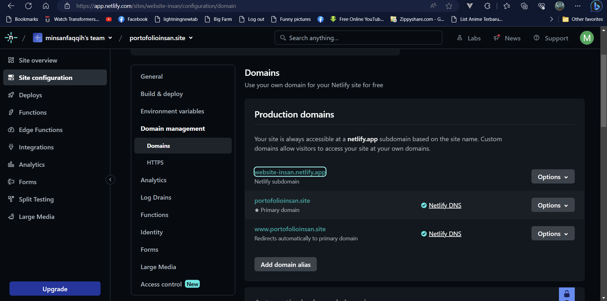

# Tugas Week4 (Membuat Website dengan Custom domain dan penjelasan Readme)
## Hal-Hal yang dibutuhkan antara lain
1. Memiliki Website
2. Membeli domain di niagahoster(contohnya)
3. Build website di netlify
4. Membuat custom domain dan subdomain

# Step by step membuat website dengan custom domain
1. Langkah pertama membuat website sederhana terlebih dahulu. Contohnya sebagai berikut.

tempilan website ini saya buat di vs code. Website ini berisi portofolio saya. Untuk kodingannya ada di repository saya.
2. Langkah Kedua membeli domain di Niagahoster
Domain yang saya beli .site harga cukup terjangkau Rp 15000 untuk satu tahun. 
 Setelah membeli domain selanjutnya untuk build website di [netlify](https:\\www.netlify.com)
3. Kemudian membuat akun di [netlify](https:\\www.netlify.com). Caranya sebagai berikut. 
   * Pastikan menggunakan email yang belum di daftar di netlify
   * Verisikasi email dari netlify
   * Setelah itu akan masuk ke halaman netlify. Setting-setting akun
   * Deploy di netlify ada dua opsi. Bisa pakai local file(upload file html,css,js) ke netlify atau bisa pakai menghubungkan repository ke netlify. Repository yang saya pakai [Github](https:\\www.github.com)
   * Menghubungkan akun github ke netlify 
   * Pilih Repository yang mau dideploy. Karena ini tugas week 4 maka saya pilih tugas-week-4 
   * Setelah itu click deploy 
   * Website berhasil dideploy di netlify
4. Custom domain. Saya menggunakan eksternal DNS di [cloudflare](https:\\www.cloudflare.com)
   * Langkah pertama membuat akun di [cloudflare](https:\\www.cloudflare.com)
   * Setelah selesai daftar dan verifikasi email dari cloudflare
   * Tambahkan domain di cloudflare
   * Pilih paket. Saya pilih paket yang free. Paket free ini juga  dapat Sertifikat SSL dan pengamanan dari ddos walaupun terbatas
   * Ubah name server yang di niagahoster dengan name server dari cloudflare Setelah diubah name server di niagahoster. tampilannya sebagai berikut.
   * Kemudian kembali ke website cloudflare untuk check name server. Pada langkah ini memakan waktu cukup lama kurang lebih 1 jam paling lama satu hari.
   * Setelah check name server selesai akun muncul seperti ini  Domain akan aktif
   * Kemudian click domain yang sudah aktif. setelah itu klik menu DNS
   * Setelah itu klik record untuk menambahkan subdomain FYI type sendiri ada berbagai tipe contohnya A, AAAA, CNAME, MX, dll.
        ## A 
        A (Address) jadi jika domainnya mau di root(@) ke sebuah IPv4(Internet Protocol) contohnya ip4 121.12.153.123. IPv4 32bit
        ## AAAA
        AAAA Untuk IP6 sama seperti type A cuma untuk IPv6. Jika IPv4 sudah tidak cukup maka pakai IPv6. Contoh IPv6 2001:cdba:0000:0000:0000:0000:3257:9652. IPv6 128bit
        ## CNAME
        Cname(Canonical Name) adalah salah satu recods DNS. tujuannya untuk mengarahkan dan menyambungkan subdomain ke domain utama.
        ## MX
        MX(mail exchanger) adalah salah records DNS untuk pengiriman email ke domain anda.
    * Setelah ditambahkan subdomain akan muncul tampilan sebagai berikut 
    * Setelah itu kembali ke netlify. Pilih menu domain. Setelah itu add domain yang sudah terdaftar dan subdomainnya
    * Setelah itu uji coba Website
### Selesai
  
